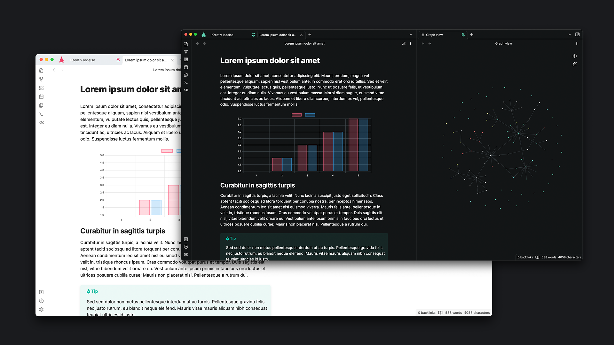

# Gyldendal Obsidian Theme

You might have to manually set accent colors for the respective themes. In that case, go to *Settings -> Appearance -> Accent Color* and set one of the following:

- **Light theme:** #ee4369
- **Dark theme:** #5fd3b2

